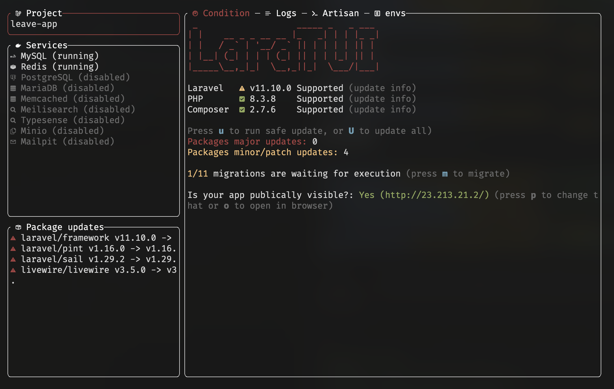

# LaraTUI

LaraTUI is terminal user interface for laravel local environment

Project is something between PoC and pre-Alpha. There are no tests, some parts are mocked, and it needs some refactoring.

## Requirements

- PHP >= 8.2
- Composer
- laravel/sail with docker
- NerdFont

## Todo

- [x] prepare framework using reactphp event loop
- [x] read status of docker containers
- [x] read status of composer packages
- [x] run docker compose up and read logs in app
- [x] run migrations and handle output of it
- [x] start using php-tui events reading
- [x] PHP and Composer versions check
- [x] check migration status
- [ ] add more info about versions updating
- [ ] LaraTUI config to keep status of all projects
- [ ] update packages functionality
- [ ] automatic help popup on `?`
- [ ] envs view
- [ ] logs view
- [ ] running artisan commands with quick commands
- [ ] support other envs than laravel sail like laradock or vault
- [ ] implement project creating window
- [ ] implement composer audit execution
